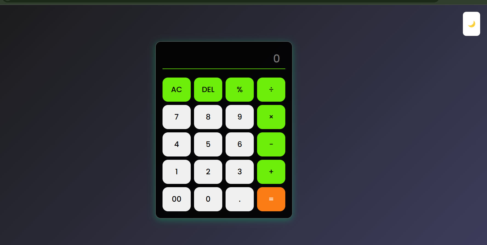
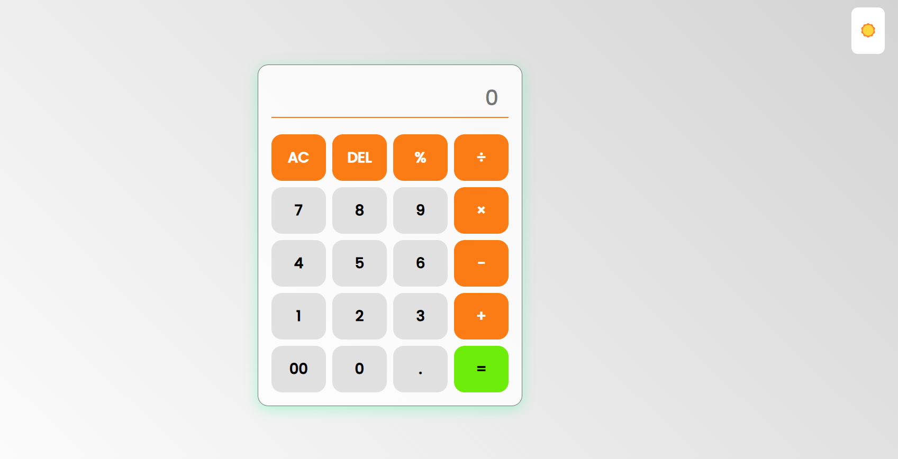

🧮 Advanced Calculator
A simple yet powerful calculator built using HTML, CSS, and JavaScript. It supports basic arithmetic operations, a dark/light mode switch, and keyboard input support.

🚀 Features
✔️ Basic Operations: Addition, Subtraction, Multiplication, Division, Percentage
✔️ Keyboard Support: Use Enter, Backspace, Escape, and numeric keys
✔️ Light/Dark Theme Toggle
✔️ Error Handling for Invalid Inputs
✔️ Responsive Design (Works on Desktop & Mobile)

📸 Preview
### 🌙 Dark Mode  
  

### ☀️ Light Mode  
  

🚀 How to Use
1️⃣ Click numbers and operators to perform calculations
2️⃣ Press AC to clear input, DEL to delete the last character
3️⃣ Use your keyboard for quick input

🛠️ Technologies Used
HTML5
CSS3
JavaScript (Vanilla JS)
📦 Installation
Clone the repo
git clone https://github.com/Kanneboinashivakumar/Advanced-Calculator.git
cd Advanced-Calculator